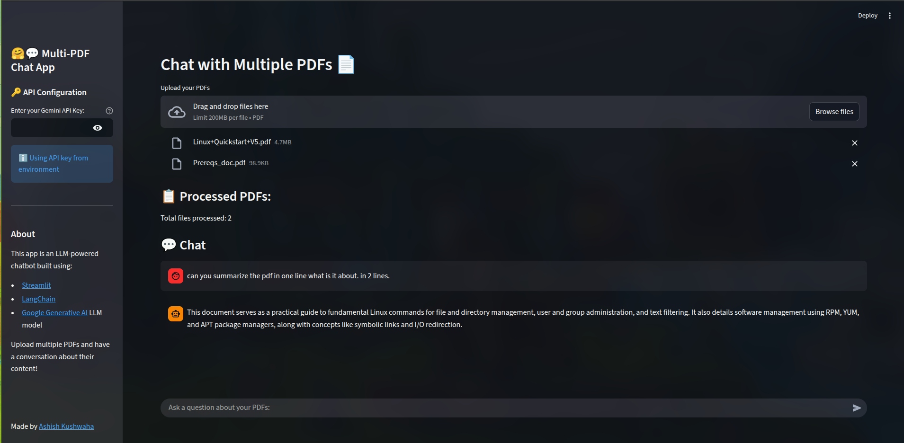

# 📄🤖 ContextPDF: Multi-PDF Chat App

A Streamlit + LangChain + Gemini powered chatbot that lets you **upload multiple PDFs and chat with them**.
The app extracts text, creates embeddings, stores them locally using FAISS, and answers your questions using RAG.



## 🚀 Features

- Upload **multiple PDFs**
- Chat with content using **RAG**
- **Gemini 2.5 Flash** for responses
- **FAISS** for fast vector search
- Automatic **PDF hashing** to avoid duplicate processing
- Local **persistent vector store** (`multi_pdf_store/`)
- Clean Streamlit UI with chat history & reset options

## 🛠️ Tech Stack

- Streamlit
- LangChain
- Google Gemini
- FAISS
- PyPDFLoader
- RecursiveCharacterTextSplitter

## 📦 Setup

### 1. Install dependencies

```bash
pip install -r requirements.txt
```

### 2. Run the app

```bash
streamlit run app.py
```

### 3. Configure API Key

Enter your **Gemini API key** in the sidebar or place it in `.env` as:

```
GOOGLE_API_KEY=your_key
```

## 📁 How It Works

1. PDFs → text extraction
2. Text → chunking
3. Chunk → embeddings (Gemini)
4. Stored in **FAISS**
5. RAG pipeline retrieves best chunks and generates an answer

## 🔧 Reset Options

- **Clear Chat**
- **Reset All**: removes chat, processed file hashes, and FAISS store
